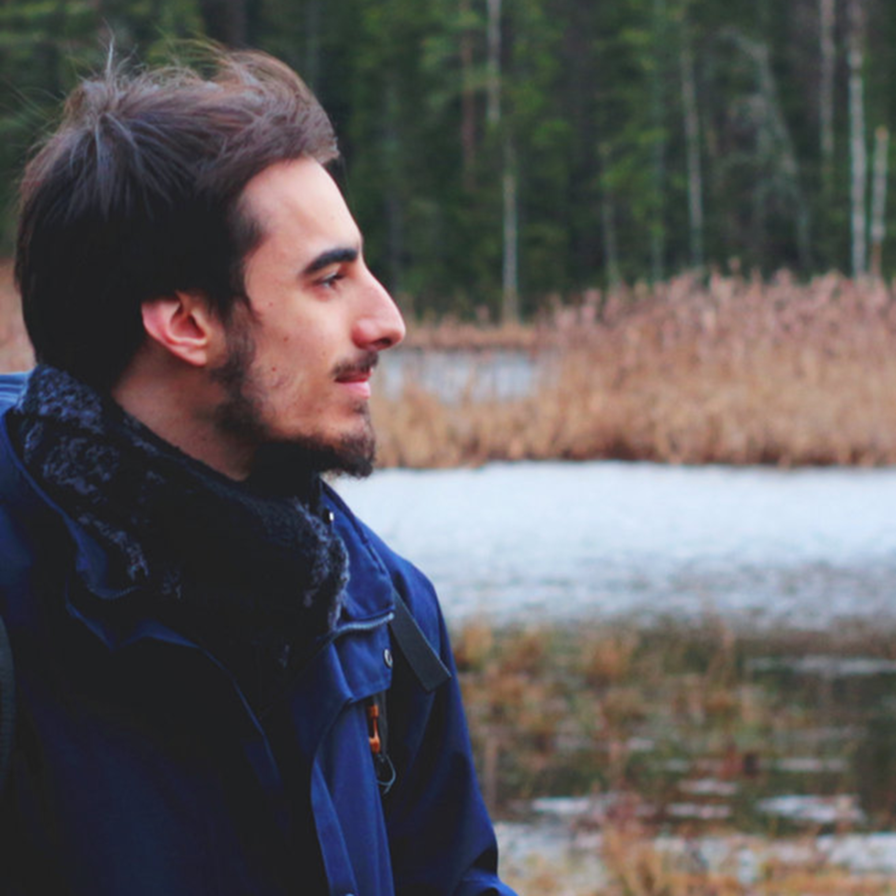

  
  

    <h1 class="title">Hi I'm Nic!</h1>
    

  <a href="https://scholar.google.com/citations?hl=it&user=aSO8OaUAAAAJ" target="_blank" rel="noopener" style="display:inline-flex;align-items:center;gap:0.5rem;text-decoration:none;color:var(--color-accent-2);">
    <svg viewBox="0 0 24 24" role="img" aria-hidden="true" style="width:20px;height:20px;opacity:0.9;" xmlns="http://www.w3.org/2000/svg" fill="currentColor">
      <path d="M12 24a7 7 0 1 1 0-14 7 7 0 0 1 0 14zm0-24L0 9.5l4.838 3.94A8 8 0 0 1 12 9a8 8 0 0 1 7.162 4.44L24 9.5z"/>
    </svg>
    Scholar
  </a>

  <a href="https://unibo.academia.edu/NicolaRenzi" target="_blank" rel="noopener" style="display:inline-flex;align-items:center;gap:0.5rem;text-decoration:none;color:var(--color-accent-2);">
  <svg viewBox="0 0 24 24" xmlns="http://www.w3.org/2000/svg" fill="currentColor" aria-hidden="true" style="width:20px;height:20px;opacity:0.9;"><path d="M12 2L1 22h4l2.3-4.5h9.4L19 22h4L12 2zm-3.1 11L12 6.7 15.1 13H8.9z"/></svg>
  Academia
</a>

<a href="https://www.youtube.com/@nicola_renzi" target="_blank" rel="noopener" style="display:inline-flex;align-items:center;gap:0.5rem;text-decoration:none;color:var(--color-accent-2);"><svg viewBox="0 0 24 24" xmlns="http://www.w3.org/2000/svg" fill="currentColor" aria-hidden="true" style="width:20px;height:20px;opacity:0.9;"><path d="M23.498 6.186a3.02 3.02 0 0 0-2.124-2.136C19.5 3.5 12 3.5 12 3.5s-7.5 0-9.374.55A3.02 3.02 0 0 0 .502 6.186 31.7 31.7 0 0 0 0 12a31.7 31.7 0 0 0 .502 5.814 3.02 3.02 0 0 0 2.124 2.136C4.5 20.5 12 20.5 12 20.5s7.5 0 9.374-.55a3.02 3.02 0 0 0 2.124-2.136A31.7 31.7 0 0 0 24 12a31.7 31.7 0 0 0-.502-5.814zM9.75 15.5v-7l6 3.5-6 3.5z"/></svg>
  YouTube
</a>

<a href="https://nicolarenzi.bandcamp.com/" target="_blank" rel="noopener" style="display:inline-flex;align-items:center;gap:0.5rem;text-decoration:none;color:var(--color-accent-2);"> <svg viewBox="0 0 24 24" xmlns="http://www.w3.org/2000/svg" fill="currentColor" aria-hidden="true" style="width:20px;height:20px;opacity:0.9;"><path d="M2 18L9.6 6h12.4L14.4 18H2z"/></svg>
  Bandcamp
</a>

  <a href="https://www.linkedin.com/in/nicola-renzi-2b4301227/" target="_blank" rel="noopener" style="display:inline-flex;align-items:center;gap:0.5rem;text-decoration:none;color:var(--color-accent-2);">
    <svg stroke="currentColor" fill="currentColor" stroke-width="0" viewBox="0 0 24 24" aria-hidden="true" style="width:20px;height:20px;opacity:0.9;" xmlns="http://www.w3.org/2000/svg"><path d="M20 3H4a1 1 0 0 0-1 1v16a1 1 0 0 0 1 1h16a1 1 0 0 0 1-1V4a1 1 0 0 0-1-1zM8.339 18.337H5.667v-8.59h2.672v8.59zM7.003 8.574a1.548 1.548 0 1 1 0-3.096 1.548 1.548 0 0 1 0 3.096zm11.335 9.763h-2.669V14.16c0-.996-.018-2.277-1.388-2.277-1.39 0-1.601 1.086-1.601 2.207v4.248h-2.667v-8.59h2.56v1.174h.037c.355-.675 1.227-1.387 2.524-1.387 2.704 0 3.203 1.778 3.203 4.092v4.71z"></path></svg>
    LinkedIn
  </a>
  
  <a href="mailto:nico.renzi22@gmail.com" style="display:inline-flex;align-items:center;gap:0.5rem;text-decoration:none;color:var(--color-accent-2);">
    <svg xmlns="http://www.w3.org/2000/svg" width="16" height="16" fill="currentColor" class="bi bi-envelope" viewBox="0 0 16 16" style="width:20px;height:20px;opacity:0.9;"> <path d="M0 4a2 2 0 0 1 2-2h12a2 2 0 0 1 2 2v8a2 2 0 0 1-2 2H2a2 2 0 0 1-2-2zm2-1a1 1 0 0 0-1 1v.217l7 4.2 7-4.2V4a1 1 0 0 0-1-1zm13 2.383-4.708 2.825L15 11.105zm-.034 6.876-5.64-3.471L8 9.583l-1.326-.795-5.64 3.47A1 1 0 0 0 2 13h12a1 1 0 0 0 .966-.741M1 11.105l4.708-2.897L1 5.383z" stroke="currentColor" stroke-width="0.5"/></svg>
  Email
  </a>
    

  

  
 I am an anthropologist, field recordist, sound artist, and filmmaker from Bologna, Italy. Through interdisciplinary scholarship and artistic practice, I explore how relations between human communities and environments emerge through listening, sounding, and their entanglement with ecological change and power. My work mainly moves between my maternal community in Campidano (Sardinia) and the ancestral and unceded lands of the Sámi, in the European Arctic—geographies where local ways of listening respond to and resist state-driven resource extraction in different yet resonant ways. My main research interests include <a href="https://www.academia.edu/128358469/More_than_music_Echosystems_acoustemologies_and_histories_of_listening_from_S%C3%A1pmi" target="_blank" rel="noopener">‘more-than-music’</a>, Indigenous acoustemologies, mosquito musicking, biocultural heritage, multimodal field recording, and sustainable soundscape conservation. Across fieldwork, academic venues, and art spaces, my work asks how we might create space for other-than-human voices that are systematically excluded from colonial systems of value, yet act as constitutive participants in shared heritages and increasingly conflictual sound worlds.

In 2025, I completed dual PhDs in Indigenous Studies at the University of Helsinki and in Anthropology and Ecology of Sound at the University of Bologna. I currently hold a postdoctoral fellowship (2026–2028) at the Centre of Excellence in MultiBEING Justice, University of Helsinki. I have taught Anthropology of Music as an adjunct professor at the University of Turin and held a faculty position at the Department of Arts, University of Bologna. I have also been a guest lecturer in musicology, sound studies, and anthropology at universities across Europe [IT][NO][FI] and the Americas [BR][US]. Since 2020, I have authored over fifteen scholarly publications, including the open-access monograph <a href="http://hdl.handle.net/10138/593302" target="_blank" rel="noopener"><em>More-than-Music. Echosystems, Acoustemologies and Histories of Listening from Sápmi</em></a> (Dissertationes Universitatis Helsingiensis, 2025). I have also translated into Italian key works in sound and music studies, including <em>Acoustemology: Four Lectures</em> by Steven Feld and <em>Overtone Singing</em> by Mark van Tongeren.

I enjoy working with multimodal approaches to field recording and engaging diverse open-science practices, including documentary films, podcasts, audio anthologies, and sound installations. Across these outputs, co-authorship is central to how I work, guiding a commitment to transparent intellectual property and to local self-determination over knowledge, heritage, and education. One example of this approach is the <a href="https://www.youtube.com/watch?v=2C_S6dTu80Q&list=PLk2F6cTXV0Q88FSPCvleQDgcpvHMoWjYR&pp=sAgC" target="_blank" rel="noopener"><em>Histories of Listening from…</em></a> audio-anthology series, launched through a curated collection of stories by ten Sámi sound experts and practitioners. My field recordings have also featured in international podcasts, films, museums and art exhibitions across Europe [IT][NO][SE][FI], through creative collaborations with artists, curators, and communities.

As an independent project, in 2019 I coined the fictional field of ‘xenomusicology’ and introduced it through the artistic research project <a href="https://nicolarenzi.bandcamp.com/album/interstellar-ethnographies-vol-i-a-study-on-xenomusicology" target="_blank" rel="noopener"><em>Interstellar Ethnographies (Vol. I)</em></a>—an experimental collection of didascalic sound works and narrations framed as a speculative study of extraterrestrial musical cultures. The project brings together critical approaches to the world’s musics with analyses of science-fiction soundtracks and diegetic sound, alongside imaginative explorations of otherworldly forms of musicking.

