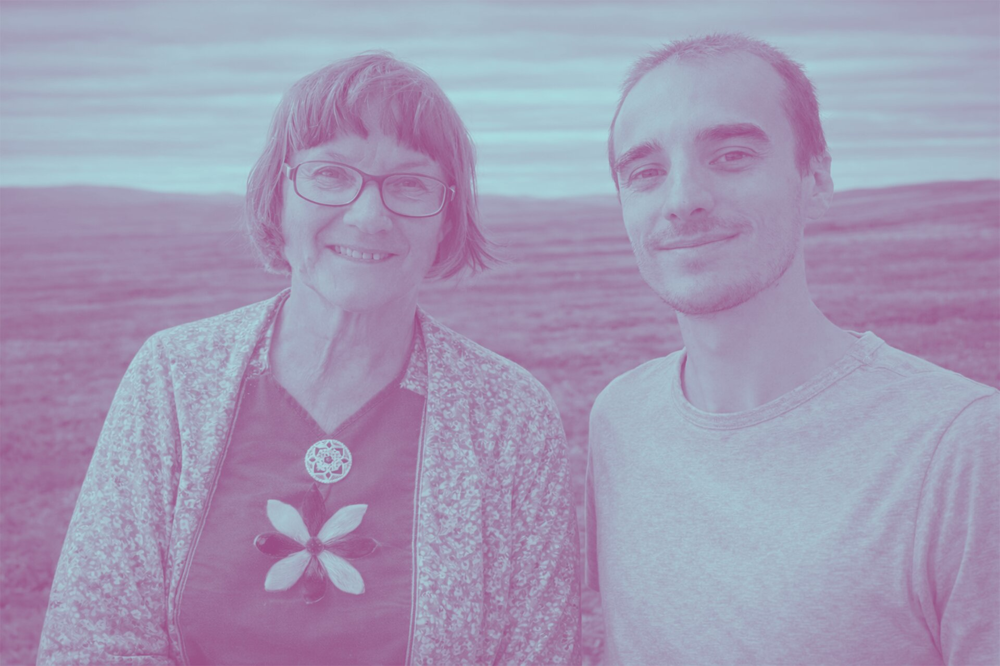
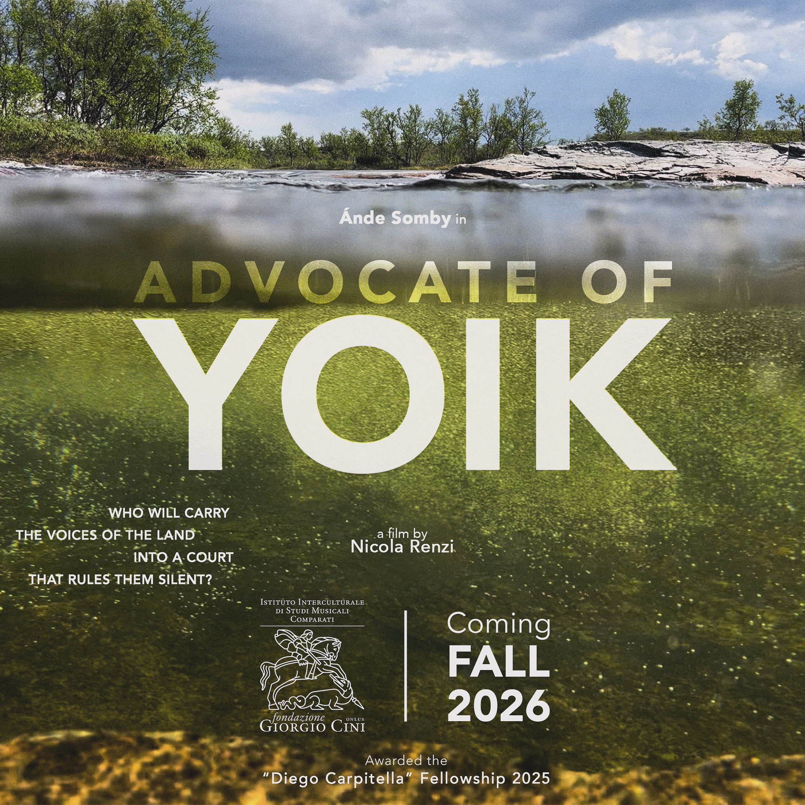

# News

    

      
      

    

        <h3 class="publication-title">
                UPCOMING INSTALLATION: Čuoikkariššu / Mosquito Shower
            </a>
        </h3>
        
Sound Installation
        

        
Čuoikkariššu / Mosquito Shower is a sound shower invited as part of the Arctic Art Forum 2026, opening on March 7, 2026, at the Climate House of the Natural History Museum of Oslo, Norway. Curated by Italian sound artist and ecologist Nicola Renzi together with Indigenous Sámi scholar and yoik performer Mai Britt Utsi, Čuoikkariššu / Mosquito Shower engages with AAF26’s theme of Climate Microchanges by turning attention to tiny beings with outsized ecological impact in the Arctic.

        
March 7–26, 2026

    

    

      
      

    

        <h3 class="publication-title">
                UPCOMING CONCERT: Bárut, Riehppovuotna
            </a>
        </h3>
        
Concert
        

        
<em>Bárut, Riehppovuotna</em> is the result of a collaboration between Sámi researcher, activist, artist, and writer Tuula Sharma Vassvik and Italian sound ecologist and artist Nicola Renzi. Composed of four interwoven <em>luođit</em> [joik melodies] carried by a shifting seascape, the suite follows the course of a day in the life of Riehppovuotna, drawing attention to the fjord’s changing rhythms, presences, and entanglements—both above and below the water’s surface. Through locally recorded sounds and joiking, the piece invites listeners to reflect on the coexistence of beings and elements in the fjord, and on how human presence can nurture this balance, or unsettle it. Beneath the surface, a troubling silence quickly emerges, leaving behind only the screeching traces of its own cause. To listen and attend to the lively voices of the fjord is, now more than ever, to care and to resist.

        
March 14, 2026

    

    

      
      

    

        <h3 class="publication-title">
                UPCOMING FILM: Advocate of Yoik
            </a>
        </h3>
        
Film
        

        
I’m thrilled to share that my film "𝑨𝒅𝒗𝒐𝒄𝒂𝒕𝒆 𝒐𝒇 𝒀𝒐𝒊𝒌" will come to life with the support of the Intercultural Institute for Comparative Music Studies (IISMC) at the Fondazione Giorgio Cini in Venice. The project has been awarded the prestigious 𝑫𝒊𝒆𝒈𝒐 𝑪𝒂𝒓𝒑𝒊𝒕𝒆𝒍𝒍𝒂 𝑭𝒆𝒍𝒍𝒐𝒘𝒔𝒉𝒊𝒑, which the IISMC grants each year to audiovisual research initiatives of particular ethnomusicological relevance. Through the life journey of my dear friend and mentor Ande Somby, the film will explore yoik as a relational vocal practice and a form of ecological advocacy.

        
Coming Soon — Fall 2026

    

