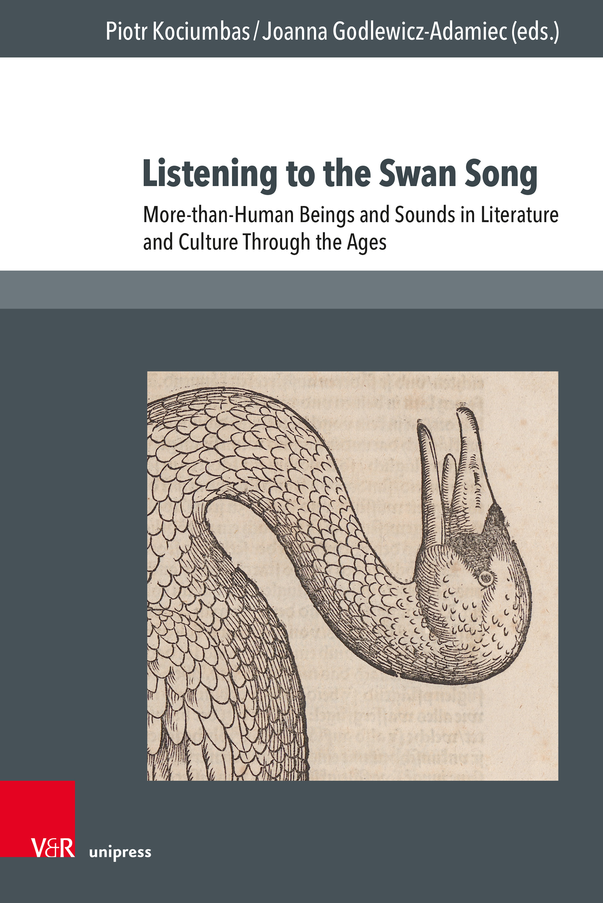

# Latest publications

## 2026

    

        
    

    

        <h3 class="publication-title">
            <a href="https://doi.org/10.14220/9783737019781.133" class="publication-link">
                An Ode to Culex: Listening with Mosquitoes, from Virgil to Sápmi
            </a>
        </h3>
        
Listening to the Swan Song. More-than-Human Beings and Sounds in Literature and Culture Through the Ages (eds. P. Kociumbas & J. Godlewicz-Adamiec)

        
Nicola Renzi

        
2026

        

            MosquitoAcoustemologyClassic literature
            <a href="https://doi.org/10.14220/9783737019781.133" class="tag tag-arxiv">DOI</a>
            <a href="https://www.academia.edu/166870953/An_Ode_to_Culex_Listening_with_Mosquitoes_from_Virgil_to_S%C3%A1pmi" class="tag tag-github">Academia.edu</a>
        

    

## 2025

    

        
    

    

        <h3 class="publication-title">
            <a href="http://hdl.handle.net/10138/593302" class="publication-link">
                More-than-music: Echosystems, acoustemologies and histories of listening from Sápmi
            </a>
        </h3>
        
Dissertationes Universitatis Helsingiensis

        
Nicola Renzi

        
2025

        

            Anthropology and Ecology of Sound
            <a href="http://hdl.handle.net/10138/593302" class="tag tag-arxiv">Official repository</a>
            <a href="https://www.academia.edu/128358469/More_than_music_Echosystems_acoustemologies_and_histories_of_listening_from_S%C3%A1pmi" class="tag tag-github">Academia.edu</a>
        

    

## 2024

    

        
    

    

        <h3 class="publication-title">
            <a href="https://www.soundethnographies.it/vii-1-2-2024/etnografie-sonore-sound-ethnographies-n-vii-1-2024/renzi-2024/" class="publication-link">
                Rethinking Silence within Arctic Echosystems
            </a>
        </h3>
        
Sound Ethnographies

        
Nicola Renzi (with stories by Inger-Mari Aikio, Mathis Eira and Ellen-Johanne Kvalsvik)

        
2024

        

            Silence
            Acoustic Ecology
            Aesthetic
            <a href="https://www.soundethnographies.it/vii-1-2-2024/etnografie-sonore-sound-ethnographies-n-vii-1-2024/renzi-2024/" class="tag tag-arxiv">Journal's website</a>
            <a href="https://doi.org/10.5281/zenodo.17792187" class="tag tag-github">DOI</a>
        

    

  <a href="https://helsinki.academia.edu/NicolaRenzi" class="cactus-link" target="_blank" rel="noopener">
    Click for more publications
  </a>

