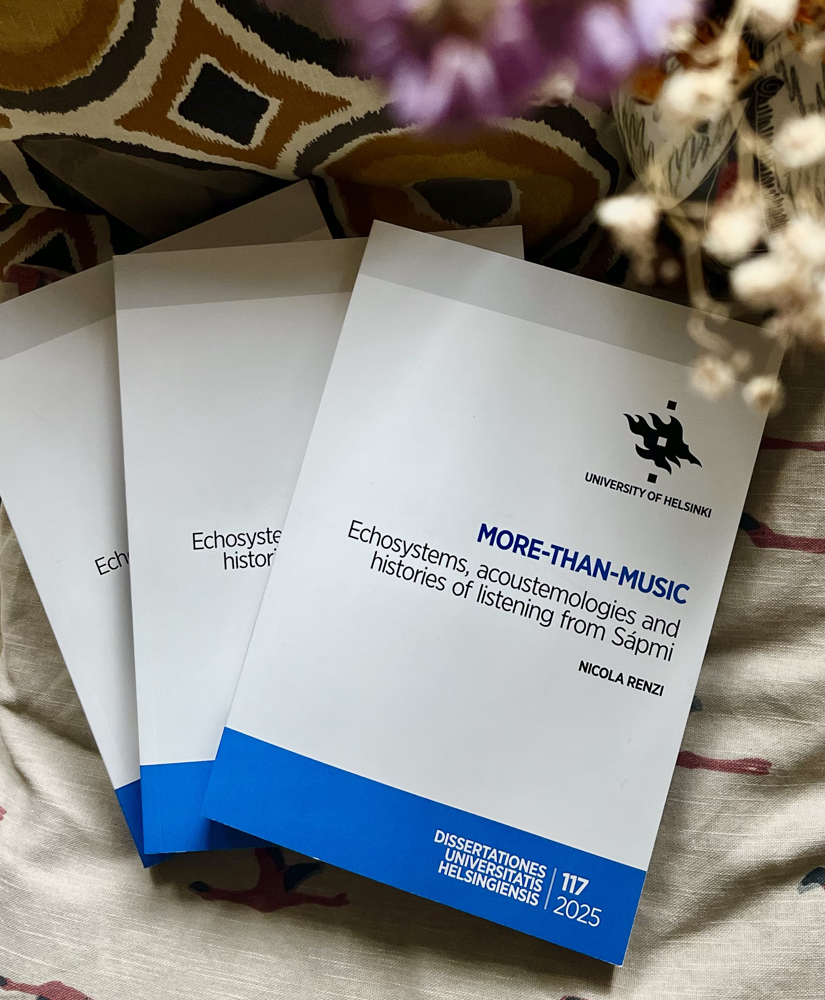

# Latest publications

## 2025

    

        
    

    

        <h3 class="publication-title">
            <a href="http://hdl.handle.net/10138/593302" class="publication-link">
                More-than-music: Echosystems, acoustemologies and histories of listening from Sápmi
            </a>
        </h3>
        
Dissertationes Universitatis Helsingiensis

        
Nicola Renzi

        
2025

        

            Anthropology and Ecology of Sound
            <a href="http://hdl.handle.net/10138/593302" class="tag tag-arxiv">Official repository</a>
            <a href="https://www.academia.edu/128358469/More_than_music_Echosystems_acoustemologies_and_histories_of_listening_from_S%C3%A1pmi" class="tag tag-github">Academia.edu</a>
        

    

## 2024

    

        
    

    

        <h3 class="publication-title">
            <a href="https://www.soundethnographies.it/vii-1-2-2024/etnografie-sonore-sound-ethnographies-n-vii-1-2024/renzi-2024/" class="publication-link">
                Rethinking Silence within Arctic Echosystems
            </a>
        </h3>
        
Sound Ethnographies

        
Nicola Renzi (with stories by Inger-Mari Aikio, Mathis Eira and Ellen-Johanne Kvalsvik)

        
2024

        

            Silence
            Acoustic Ecology
            Aesthetic
            <a href="https://www.soundethnographies.it/vii-1-2-2024/etnografie-sonore-sound-ethnographies-n-vii-1-2024/renzi-2024/" class="tag tag-arxiv">Journal's website</a>
            <a href="https://doi.org/10.5281/zenodo.17792187" class="tag tag-github">DOI</a>
        

    

  

    Click for more publications
    Hide publications
  

  

   
      ## 2020

    

        
    

    

        <h3 class="publication-title">
            <a href="https://www.soundethnographies.it/it/the-sami-drum-from-oracular-rituality-to-musical-perform/" class="publication-link">
                The Sami Drum from Oracular Rituality to Musical Performance
            </a>
        </h3>
        
Sound Ethnographies

        
Nicola Renzi

        
2020

        

            Organology
            Ethnomusicology
            Sámi drum
            Iconography

            <a href="https://www.soundethnographies.it/" class="tag tag-arxiv">Journal's website</a>
        

    

  

